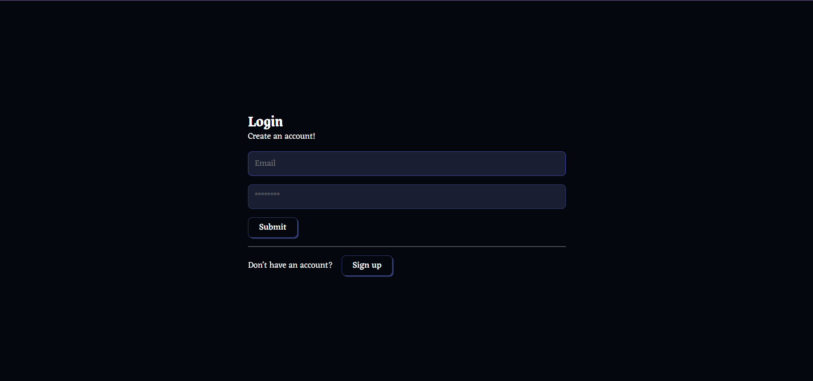
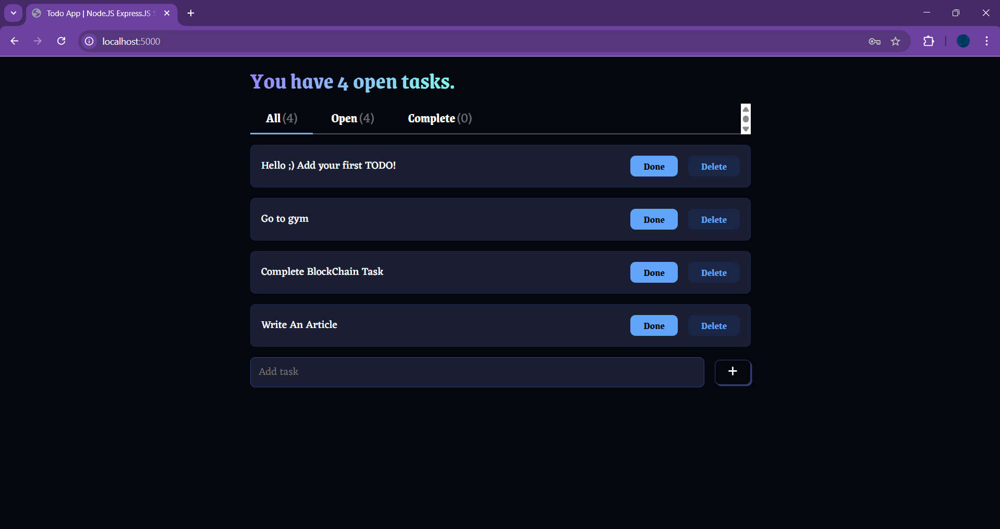

## 📌 Node.js SQLite To-Do App

A simple **To-Do List** application built using **Node.js** and **SQLite**, featuring authentication, middleware handling, and RESTful APIs.

### 🖼️ Project Screenshots

#### Login Page



#### Dashboard



---

## 📁 Project Structure

```
NODEJS-SQLITE/
│── Images/                  # Contains project images/screenshots
│   ├── Dashboard.png
│   ├── Login.png
│── node_modules/            # Dependencies (auto-generated)
│── public/                  # Static files (CSS, HTML)
│   ├── fanta.css
│   ├── index.html
│   ├── styles.css
│── src/                     # Source code
│   ├── middleware/          # Authentication Middleware
│   │   ├── authMiddleware.js
│   ├── routes/              # API Routes
│   │   ├── authRoutes.js
│   │   ├── todoRoutes.js
│   ├── db.js                # Database connection
│   ├── server.js            # Main server file
│── .env                     # Environment variables
│── package.json             # Project dependencies
│── package-lock.json        # Package lock file
│── todo-app.rest            # API testing file
```

---

## 🛠️ Installation & Setup

1. **Clone the repository**

   ```sh
   git clone https://github.com/Arbiter09/nodejs-sqlite-todo.git
   cd nodejs-sqlite-todo
   ```

2. **Install dependencies**

   ```sh
   npm install
   ```

3. **Set up environment variables**  
   Create a `.env` file in the root directory and add:

   ```env
   DATABASE_URL=sqlite:./database.sqlite
   SECRET_KEY=your_secret_key
   ```

4. **Run the server**

   ```sh
   node src/server.js
   ```

5. **API Testing**
   Use `todo-app.rest` in VS Code to test API endpoints.

---

## 🚀 Features

✅ **User Authentication** (Sign-up/Login)  
✅ **JWT-Based Authentication Middleware**  
✅ **CRUD Operations for To-Do List**  
✅ **SQLite Database**  
✅ **RESTful API Endpoints**

---

## 📌 API Endpoints

### 🔐 Authentication

| Method | Endpoint       | Description       |
| ------ | -------------- | ----------------- |
| POST   | `/auth/login`  | User Login        |
| POST   | `/auth/signup` | User Registration |

### 📋 To-Do List

| Method | Endpoint     | Description       |
| ------ | ------------ | ----------------- |
| GET    | `/todos`     | Get all todos     |
| POST   | `/todos`     | Create a new todo |
| PUT    | `/todos/:id` | Update a todo     |
| DELETE | `/todos/:id` | Delete a todo     |

---

## 🏗️ Tech Stack

- **Backend:** Node.js, Express.js
- **Database:** SQLite
- **Authentication:** JWT, bcrypt
- **Frontend:** HTML, CSS

---


## 📜 License

This project is open-source under the **MIT License**.

---
